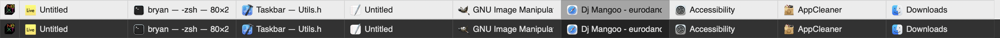

Fork from nicolasjinchereau/taskbar-mac.

## Installation
* Download the latest release of `Taskbar` from [Github](https://github.com/nicolasjinchereau/taskbar-mac/releases)
* Alternatively, rebuild the XCode project in `/source` (optional)
* Drag `Taskbar.app` into the `/Applications` folder
* Run `Taskbar.app` and add it to allowed apps in the `Security/Accessibility/Privacy` preferences.
* Right click the Apple button and select "Toggle Fast Dock" (optionally removes delay from dock show/hide animation)

##Release notes
*Fixed deprecated dependencies.
*Added Disable Dock option.
*Dark/Light mode compliant and compact design.
*Ongoing issues: Lack of support for multiple spaces and displays, inability to recursively include apps from multiple directories into "Applications" menu item. I hope someone helps someday :)

## Screenshots

